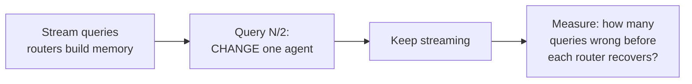

# Idea 01 — Versioned routing memory under agent capability drift

**Status:** design agreed, nothing built yet
**Date:** 6 September 2026
**Background:** `notes/01-premise-verification.md`, `notes/02-landscape-survey.md`, `summaries/`

---

## 1. The idea in one paragraph

An agent router learns which agent to send each query to by remembering what happened before. But agents change — new prompts, new tools, new models. The moment an agent changes, memories about it become wrong. **Every existing system can add memories and none can retire them.** We propose routing memory where each record carries a validity period and an agent version, invalidated instantly when a deployment event says the agent changed — rather than distilled away, overwritten, blended into embeddings, or deleted. We evaluate under controlled capability shift, a setting no routing paper has tested.

## 2. The problem, plainly

Three agents at CBA: **A** handles BG amendments, **B** handles issuance, **C** handles general trade finance.

A query arrives: *"Can we extend the expiry date on BG-4471?"* The router remembers *"March — a similar expiry question went to A, worked fine"* and sends it to A.

In June, someone updates A. Expiry work now belongs to B.

```
March ──────────── June ──────────── now
  │                  │
  │                  └─ Agent A redeployed; expiry work moves to B
  │
  └─ Memory: "expiry → Agent A ✓"
                     ↑
        now WRONG, and nothing in the system knows
```

**"Drift" just means: the agent moved, the memory didn't.**

## 3. Why this is open

Six papers read end to end. Four store routing memory. **None can retire a record while keeping it.**

| System | How memory is maintained | Old record survives? |
|---|---|---|
| FlyRoute | distils successes into a description | no — compressed away |
| Agent-as-a-Router | appends to a kNN vector store | nothing is ever retired |
| GraphPlanner | blends into GNN node embeddings | no — *"no explicit temporal edges"* |
| GLOVE | `D ← D \ N` | no — explicitly deleted |

Four unrelated architectures — prompt, vector store, graph network, experience bank. Same missing capability.

**And nobody evaluates drift.** FlyRoute names it as its own future work; ACRouter's "OOD" is new *task types*; GraphPlanner's is *unseen* models. Everyone solves **cold start** (a new agent, no history). Nobody addresses **drift** (an existing agent whose history is now wrong).

> Keep these two apart in all writing. Reviewers will conflate them.

## 4. What is already taken — do not re-claim

| Claim | Taken by |
|---|---|
| "Remember decisions, not descriptions" | BoundaryRouter's ablation |
| "Learn from deployment experience" | FlyRoute, Agent-as-a-Router |
| "Memory beats bandits" | ACRouter — regret 205.5 vs LinUCB 297–307 |
| "Cumulative regret as the streaming metric" | ACRouter, explicitly |
| Versioned records with validity intervals *as a mechanism* | Temporal databases / SCD Type 2, since the 1990s |

That last row matters. **The mechanism is not the contribution.** The contribution is that routing memory is a place this obviously-correct idea has never been applied, and what that costs. Say so before a reviewer does.

## 5. The mechanism

The record. Two fields nobody else stores, one operation nobody else has:

```python
{
  "query":         "extend expiry on BG-4471",
  "candidates":    ["A", "B"],      # who was plausible  ← nobody stores this
  "chosen":        "A",
  "outcome":       "success",
  "agent":         "A",
  "agent_version": "v3",            # ← nobody stores this
  "valid_from":    "2026-03-14",
  "valid_to":      None             # ← set on deploy, instead of deleting
}
```

**Invalidation by deploy event.** A deployment is a recorded fact — a pipeline entry, a version bump, a commit, with a timestamp. So the router does not have to *detect* that an agent changed; it can be *told*.

On `Agent A: v3 → v4, 1 June`, every record with `agent=A, version=v3` gets `valid_to` stamped. One operation, zero probes, before the next query arrives.

**Why nobody else does this:** ACRouter routes to third-party models (providers update silently), GraphPlanner to benchmark models (no pipeline), GLOVE to websites and simulated environments (nobody announces a change). **We are inside the enterprise and own the pipeline.** That is a structural advantage of the industrial setting.

**Caveat — not all change is announced.** Silent model updates behind an API, tool backends changing, question mix shifting. So: deploy events as the primary trigger, outcome-watching as a backstop.

## 6. What we are building

Four components, roughly 1,500 lines of Python.

### 6.1 Simulated agent world ← build first

Agents are functions from query to success. Picture queries as points and each agent as a region it is competent in:

```
        Agent A                    Agent B
      ┌─────────┐              ┌─────────┐
      │         │              │         │
      │      ┌──┼──────────────┼──┐      │
      │      │  │   OVERLAP    │  │      │
      │      │  │  (contested) │  │      │
      │      └──┼──────────────┼──┘      │
      │         │              │         │
      └─────────┘              └─────────┘
```

- in one region only → that agent succeeds
- in the **overlap** → **both succeed** = a contested case
- outside everything → nobody succeeds = **declining is correct**

**Drift = move or shrink a region at query N.**

**Why simulated, not real LLM agents:** exact control over capability, thousands of queries in seconds, reproducible, and *releasable*. FlyRoute's biggest weakness is proprietary unreproducible data — do not inherit it. Real-LLM validation comes last and small.

**This dissolves the blocker.** Grading a close call has been stuck for two days. In simulation it is defined by construction: contested = the overlap, decline = outside everything. No annotator judgement.
*(The CBA product still needs a real answer — the paper does not wait on it.)*

### 6.2 The routers

| Router | Role |
|---|---|
| Static descriptions | naive baseline |
| FlyRoute-style flywheel | success store + periodic distillation |
| **LinUCB contextual bandit** | standard adaptive approach — **the one to beat** |
| Discounted / sliding-window bandit | strongest drift baseline |
| GLOVE-style probing | optional; probe on detected conflict |
| **Ours** | versioned memory + deploy-event invalidation |

Bandits are ~50 lines each.

### 6.3 Memory store

Records as in §5, retrieval by embedding kNN or BM25, plus the invalidation operation.

### 6.4 Evaluation harness

Run the stream, apply the intervention, measure, plot.

## 7. The experiment

1. Set up N agents with overlapping regions
2. Stream queries; let each router build memory
3. **At query N/2, deliberately change one agent's region**
4. Measure how long each router takes to recover



**Expected result:**

| Approach | Queries wrong before recovery |
|---|---|
| FlyRoute-style | many — records only successes, so cannot represent an agent getting worse |
| LinUCB bandit | many — needs repeated failures before estimates move |
| Discounted bandit | fewer, but still statistical |
| GLOVE-style probing | fewer — but must notice a conflict, then probe α times |
| **Ours** | **≈ 0** — the deploy event fires before the next query |

**Metrics:** recovery time (queries until accuracy returns to pre-drift level), cumulative regret, accuracy over time, and — for the probing baseline — number of probes spent.

**Methodology to copy:** GLOVE's — *"controlled drifts applied to standard benchmarks... applied uniformly across all methods without algorithm-specific tuning."* Their benchmarks are released at https://github.com/NICE-HKU/GLOVE; read that repo before designing ours.

## 8. Build order

| # | Step | Why |
|---|---|---|
| 1 | Simulated world + drift intervention | nothing works without it |
| 2 | Evaluation harness | measure from day one |
| 3 | Static + LinUCB baselines | establishes the floor |
| 4 | **Versioned router** | now we can see if it wins |
| 5 | FlyRoute-style baseline | more work; needs an LLM or a mock |
| 6 | Small real-LLM validation | last, and small |

**The core result is known within a week or two.** If it does not hold, that is two weekends lost, not two months.

## 9. Publication assessment

**Realistic:** a reviewed workshop or applied venue. Not top-tier ML — the mechanism is too simple and we should not pretend otherwise. That still meets the goal: an indexed, citable, peer-reviewed artefact.

| Venue | Verdict |
|---|---|
| NeurIPS / ICML / ICLR | no — mechanism too simple, contribution too applied |
| ACL / EMNLP main | unlikely, same reason |
| **FinNLP (ACL workshop)** | good fit, framed finance-first |
| **ICAIF (ACM)** | good fit — applied AI in finance, values industrial grounding |
| Responsible-AI venues | good fit — the audit angle |

### The objection that could sink it

> *"You told your method exactly when the change happened. The baselines had to infer it. Of course yours wins."*

**This is serious and correct.** Three defences, all to be designed in from the start:

1. **Argue the signal is legitimately available** — the field *infers* what it could be *told*. That is a finding about a blind spot, not a trick. State it early and explicitly.
2. **Also run the silent-drift case** — nobody tells you, detection required. Harder, more interesting, removes the objection entirely.
3. **Do not make speed the headline.**

### Lead with these instead

- **The benchmark.** No N-agent routing benchmark with capability-shift interventions exists. Benchmarks publish well and keep earning citations.
- **The audit argument.** GLOVE deletes. In a regulated setting you cannot destroy the record of why a decision was reasonable at the time. That is a compliance constraint, not a preference — and it is specific to our setting.

## 10. Working title

Decide the framing early — it changes what gets built.

| Title | Framing |
|---|---|
| *Stale by Design: Routing Memory That Cannot Expire* | survey + critique led |
| ***When the Agent Changes: A Benchmark for Routing Under Capability Drift*** | **benchmark led — recommended** |
| *EpochRouter: Versioned Routing Memory for Agent Capability Drift* | system led, follows field convention (FlyRoute, BoundaryRouter, ACRouter) |
| *Routing Under Change: Auditable Agent Selection in Regulated Environments* | finance/audit led |

⚠️ **Avoid "forgetting" as the hook.** In ML, *catastrophic forgetting* is a bad thing papers try to prevent. Our claim is the opposite, and a plain use of the word will be misread.

## 11. Open questions

- **Does CBA record agent deployments in a subscribable way** — versions, release logs, timestamps? If yes the mechanism has a real trigger. If no, that must be built first, and it is better to know now.
- Which CBA agents overlap enough to produce genuine contested cases?
- How is a contested case graded in the *real* system, where there is no overlap region to appeal to?
- Start the CBA disclosure review — long lead time, and this repo is in its scope.
