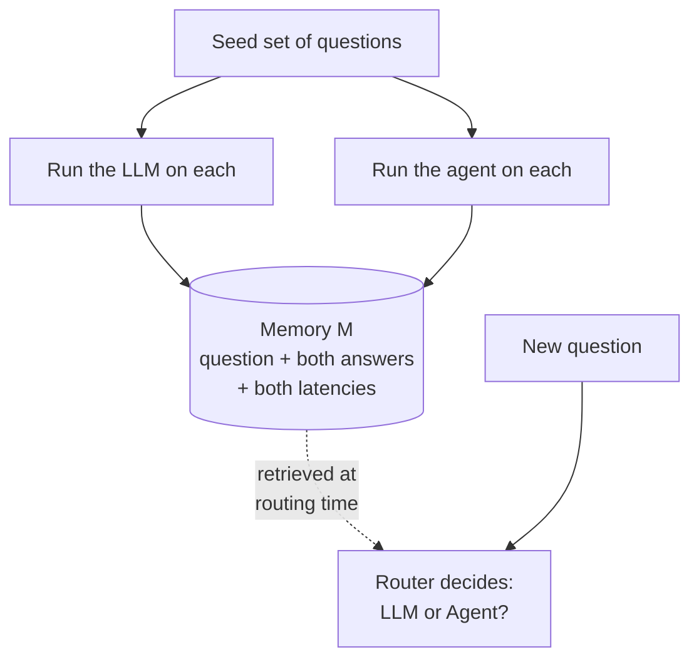

# BoundaryRouter / RouteBench — descriptive summary

**Full title:** Learning Agent Routing From Early Experience
**Authors:** Yimin Wang, Jiahao Qiu, Xuan Qi, Xinzhe Juan, Jingzhe Shi, Zelin Zhao, Hongru Wang, Shilong Liu, Mengdi Wang — SJTU, Tsinghua IIIS, Michigan, KCL, Edinburgh, Princeton
**arXiv:** [2605.07180](https://arxiv.org/abs/2605.07180) v1, 8 May 2026, cs.CL, 17 pages, CC BY 4.0
**Venue:** none — **unreviewed preprint**
**Full text:** `papers/2605.07180.txt`

> **Relevance to our track: a citation and a fence — not a competitor.**
>
> Their two options are maximally *dissimilar* (a 4s LLM vs a 4.5-minute agent, 60× cost apart). That's a **vertical** decision: is this hard enough to escalate? Ours is **horizontal**: several similar-cost agents with overlapping territory — which one owns this?
>
> Three things transfer, and nothing else does:
> 1. **It fences off a claim.** Propose "route from remembered behaviour rather than static descriptions" and a reviewer cites this paper, different setting or not.
> 2. **The *shape* of their tie-break rule** — correctness first, then a secondary criterion. Their criterion is speed, which only works because their options differ 60×. Similar-cost agents need a different second axis (authority, ownership, blast radius).
> 3. **A citable negative result:** even this easy setting isn't solved. *"Routing is surprisingly still a relatively hard problem."* If the two-way maximally-separated case is open, the N-way overlapping case clearly is.
>
> Note the word **"boundary"** means something different here — the edge of one system's competence, not the line between two peers' territories. Worth naming that distinction explicitly in our write-up.

---

## 1. In one line

Before deciding whether a question needs a slow agent or a fast LLM, look up how those two systems *behaved* on similar questions in the past — without ever being told which of them was actually right.

---

## 2. The problem they're attacking

Agents are powerful but slow and expensive. Their headline numbers: the agent is **60× slower** than a plain LLM call, for 43.7% better accuracy.

But many questions don't need an agent at all. A modern LLM answers them in one pass. So the question becomes: *where is the boundary?* Which questions fall inside the LLM's ability, and which genuinely need the full agent?

They call this finding the **"intelligence boundary"** — hence the name.

**The hard constraint they impose on themselves:** at deployment you don't know the right answer to incoming questions. So you can't train a router on labelled data, because you have no labels. This is the **cold-start** problem, and it rules out normal supervised routing.

⚠️ **Note the problem shape.** This is a **binary escalation** decision — one LLM vs. one agent. It is *not* routing across a fleet of specialist agents. Their conclusion says so directly: *"our current framework focuses on binary routing between an LLM and a single agent pipeline."* This is a different problem from the one FlyRoute solves, and different again from yours.

---

## 3. The core idea: "early experience"

Before deploying, take a small set of seed questions and **run both systems on every one of them**. Record what happened. That record is the memory.



The word **"early"** means this happens before you have any performance data — it's a bootstrap, not a training set.

**"Training-free"** is their other claim: no gradients, no fine-tuning. The router is an off-the-shelf LLM. All the "learning" happens **in the prompt** — you change behaviour by changing what you retrieve, not by changing weights. That means you can swap in a new agent by rebuilding the memory, with no retraining.

---

## 4. The key data structure — and what's deliberately missing

Memory is a list of records:

```
M = { (x, y_LLM, y_Agent, t_LLM, t_Agent) }
```

| Field | Meaning |
|---|---|
| `x` | the question |
| `y_LLM` | what the LLM answered |
| `y_Agent` | what the agent answered |
| `t_LLM` | how long the LLM took |
| `t_Agent` | how long the agent took |

Now the sentence that defines the whole design — quoted exactly:

> *"Crucially, we do not store gold answers, correctness labels, or rewards."*

**Sit with that.** The memory contains no notion of who was *right*. It stores two answers and two stopwatch readings, and nothing else.

So at routing time the model reads two past answers side by side and has to **infer for itself** which looks better, using the text of the answers and the time taken as clues. The paper calls this *"a lightweight behavioural reference that exposes systematic differences between the two systems"* — the idea being that the agent's answers *look* different (longer, multi-step, slower), and that difference alone is informative.

Compare with FlyRoute, which does exactly the opposite: it runs a judge, scores every answer, and keeps only the good ones.

---

## 5. How a single query gets routed

1. **Retrieve.** Take the new question, find the top-*K* most similar records in memory using a **hybrid retriever** — sparse keyword matching plus dense semantic similarity.
2. **Show the router.** Drop those records into the prompt: past questions, both systems' answers, both latencies.
3. **Reason under a rubric** (below).
4. **Output** one of two tokens: use the LLM, or use the agent.

---

## 6. Rubric-guided chain-of-thought (their second contribution)

They found that letting the model "think step by step" freely wasn't reliable enough — reasoning wandered, especially when questions were reworded. So they **fixed the reasoning steps in the prompt**:

> 1. **Analyze context** — compare the new question with the retrieved examples: topic, structure, complexity.
> 2. **Performance comparison** — for each example, note which system produced the better answer, considering both quality and response time.
> 3. **Pattern inference** — infer general patterns (does the agent do better on multi-step questions? does the LLM excel at direct factual ones?).
> 4. **Decision reasoning** — decide, and explain why.
> 5. **Final decision** — output exactly `FINAL ANSWER: YES` (agent) or `NO` (LLM).

The point is that the rubric names **the dimensions that actually exist in the memory**. Free-form reasoning might latch onto something the memory can't support; the rubric forces attention onto the answers and the latencies, which is all there is.

---

## 7. RouteBench — the benchmark (about half the paper)

**Where the questions come from:** 30 questions from GAIA (open-ended real-world reasoning) and 57 from MMLU (one per academic subject). **87 questions total.**

Every instance is a 5-tuple:

```
(x, y_LLM, y_Agent, y*, d)
```

question, LLM answer, agent answer, **the true answer**, and `d`, the correct routing decision.

### The ground-truth rule — read this closely

This is the part most relevant to your project. How do they decide which system *should* have been used?

> 1. **Correctness priority** — if only one system got it right, that's the answer.
> 2. **Efficiency tie-break** — if **both** are right, choose the **faster** one.
> 3. **Failure fallback** — if **both** are wrong, choose the **agent**, which has a higher chance of recovery through multi-step reasoning.

**Rule 2 is a close call being resolved by cost.** Both options work, so the cheaper one wins. That's a real, published precedent for grading contested cases — for two options.

**Rule 3 is where declining should live but doesn't.** When neither system can do the job, the correct answer is arguably "don't route this — escalate." Instead they pick the agent anyway. So "correct routing" sometimes means routing to something that fails.

### The three test sets

| Set | What it is |
|---|---|
| **Base** | The original 87 questions. In-domain. |
| **Rephrase** | The same questions reworded by an LLM, meaning preserved. Tests robustness to surface changes. |
| **Advanced** | *Different* GAIA and MMLU questions, disjoint from the others. Out-of-domain. |

⚠️ **Critical detail, easy to miss:** *"The Base Set... also serves as the early-experience corpus for retrieval-augmented routing."*

The Base Set **is** the memory. So when tested on Base, the router retrieves the very questions it is being scored on. Rephrase is the same questions in different words. **Only the Advanced Set is a clean test.**

### Metrics

- **Instance accuracy** — did it pick the right system?
- **Per-solver F1** — precision/recall/F1 for "route to LLM" and "route to agent" separately.
- **RouteBenchScore** — the headline metric: average of 4 F1 scores (2 systems × 2 sources). Used for all model comparisons.

They use F1 rather than raw accuracy so that a router which always picks the agent can't score well by exploiting class imbalance.

---

## 8. Experimental setup

| | |
|---|---|
| The "LLM" | GPT-4o |
| The "agent" | Claude Sonnet 4 for logic + GPT-4o for tool calls, in SmolAgent Open DeepResearch |
| Routers evaluated | **14 models** — GPT-5, GPT-5.2, GPT-5-nano, Gemini 3 Pro/Flash, Gemini 2.5 Pro/Flash, Claude Sonnet 4 and 4.5, Grok-4, Qwen3-32b, DeepSeek-v3.2, Kimi-K2-Thinking, MiniMax-M2 |
| Benchmark size | 87 questions per set |

---

## 9. Results

### Accuracy vs. time (averaged over both sources)

| | Base acc | Base time | Rephrase acc | Rephrase time | Advanced acc | Advanced time |
|---|---|---|---|---|---|---|
| LLM only | 0.528 | 4.4s | 0.54 | 2.3s | 0.64 | 4.5s |
| Agent only | 0.77 | 265.0s | 0.793 | 169.7s | 0.87 | 232.2s |
| **BoundaryRouter** | 0.713 | **101.9s** | 0.713 | **92.8s** | 0.77 | **91.6s** |

**The headline trade:** 60.6% less time than the agent, giving up 11.5% of its accuracy. And 28.6% more accurate than the LLM alone.

That's the whole argument, and it's a reasonable one — the agent's accuracy at roughly a third of the wait.

### Ablation — does each piece matter?

| Variant | GPT-5 | Gemini-2.5-Pro | Claude-4-Sonnet |
|---|---|---|---|
| **Prompt Routing** (capability descriptions only, no memory) | 0.41 | 0.57 | 0.55 |
| **RAG Routing** (memory, but no rubric) | 0.72 | 0.65 | 0.58 |
| **BoundaryRouter** (memory + rubric) | **0.75** | **0.71** | **0.65** |

**This is the most important table in the paper for your purposes.**

The `Prompt Routing` row routes *"based only on these capability profiles"* — hand-written descriptions of what each system is good at. It is the worst variant, everywhere, by a wide margin. Adding memory is worth **+27.5%**; adding the rubric on top is worth a further **+8.2%**.

**This is the published result that "behavioural evidence beats written descriptions."** It's why that claim is no longer available as a novel contribution.

### The 14-model leaderboard (RouteBenchScore)

| Rank | Model | Score |
|---|---|---|
| 1 | GPT-5 | 0.750 |
| 2 | Gemini-3-Pro-Preview | 0.734 |
| 3 | Gemini-2.5-Pro | 0.726 |
| … | | |
| 9 | GPT-5.2 | 0.656 |
| 11 | Claude-4.5-sonnet | 0.635 |
| 14 | GPT-5-nano | 0.578 |

Two findings they highlight:

**Routing is unexpectedly hard.** Even in-domain, on a binary choice, with the answers effectively in the memory — no model gets close to perfect.

**The out-of-domain set separates the models.** Base and Rephrase scores cluster tightly; on Advanced they spread out (top ~0.61, middle ~0.55, bottom <0.50). They argue OOD routing ability, not in-domain matching, is what distinguishes a good router.

---

## 10. What the authors acknowledge

Their limitations are thin — mostly confined to the conclusion:

- **Binary only.** One LLM, one agent. Multi-agent and heterogeneous-tool routing is named as future work.
- They frame everything else positively; there is no dedicated limitations section.

---

## 11. Things to look at closely when you read it

- **What does the memory *not* contain?** Find the sentence about gold answers and rewards. Then ask: if the router can't see who was right, what is it actually pattern-matching on?
- **Where does the memory come from, and when?** Trace whether anything is ever added after deployment. Then ask what happens when the agent is upgraded.
- **How big is the benchmark really?** 30 GAIA questions means each one moves the score by 3.3 points. Ask how much of the model leaderboard could be noise.
- **The Base Set is also the memory.** Ask what that does to the Base and Rephrase numbers, and whether Advanced is the only number you should trust.
- **Look hard at ground-truth rule 3** (both wrong → pick the agent). Ask what the *right* answer is when neither option can do the job, and what it costs to label it the way they did.
- **Rule 2 resolves a tie by speed.** Ask what you'd tie-break on with 6 agents instead of 2 — and whether speed is the right axis in a bank.
- **Compare with FlyRoute on one axis:** FlyRoute judges every answer and stores only winners. This paper stores everything and judges nothing. Ask which failure mode each choice creates.
- **GPT-5.2 ranks below GPT-5**, and Claude-4.5-sonnet sits 11th of 14. Ask whether routing skill tracks general model capability at all.

---

## My notes

<!-- your notes below -->
