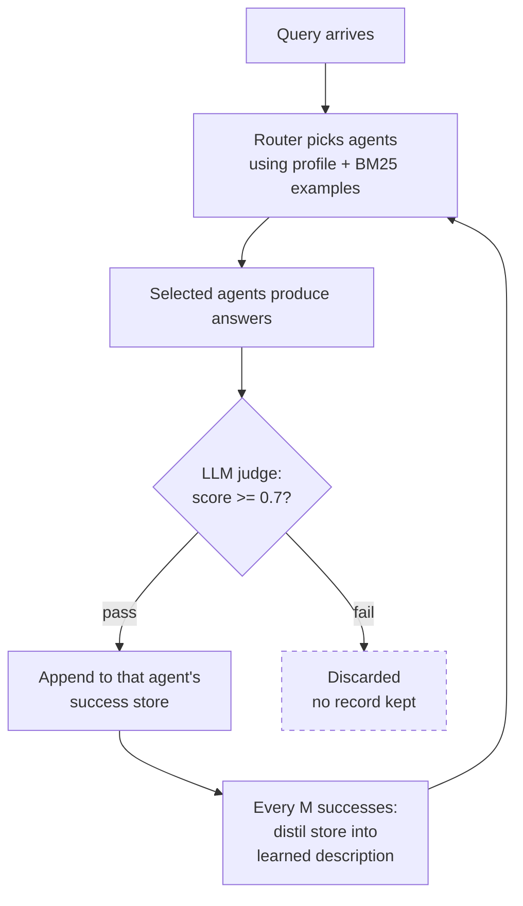
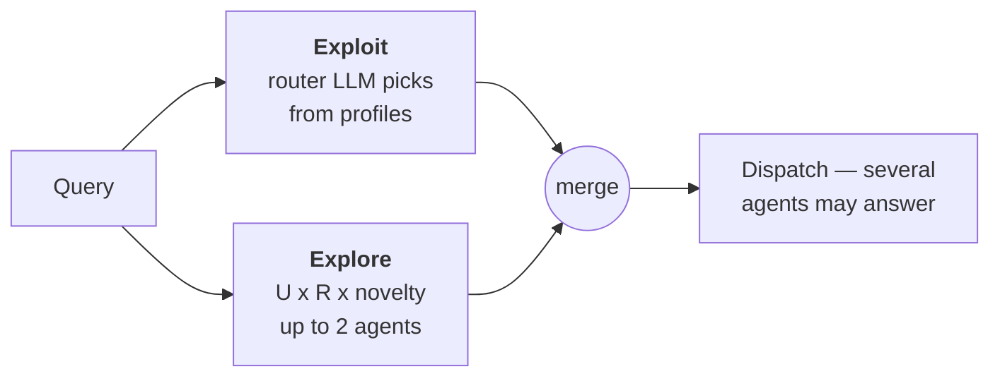

# FlyRoute — descriptive summary

**Full title:** FlyRoute: Self-Evolving Agent Profiling via Data Flywheel for Adaptive Task Routing
**Authors:** Rongjun Li, Ziyu Zhou, Yihang Wu — Huawei Technologies (IT Innovation and Research Center)
**arXiv:** [2605.22057](https://arxiv.org/abs/2605.22057) v2, submitted 21 May 2026, revised 23 July 2026
**Full text:** `papers/2605.22057.txt`

---

## 1. In one line

Instead of asking developers to write and maintain a description of what each agent does, FlyRoute **writes the descriptions itself** by watching which queries each agent handled successfully in production.

---

## 2. The problem they're attacking

A router picks which expert agent should handle each incoming query. Nearly all routers do this by comparing the query against a **written description** of each agent, supplied by the developer when the agent was registered.

The paper says this breaks for two reasons:

**Developers can't write good descriptions in the first place.** An agent's real behaviour comes from its system prompt, its tools, and its underlying model. Writing an accurate sentence about what it can and can't do is hard, and developers usually don't know where its competence actually ends. In their words, developers *"may not know which queries best characterize the agent's competence boundaries."*

**Descriptions rot after deployment.** Someone updates a prompt, adds a tool, swaps in a better model. The agent changes; the registered description doesn't. The router keeps deciding from outdated information.

Their diagnosis: the root cause is that **profiling is treated as a one-time registration step** rather than something ongoing.

---

## 3. The core idea — the "flywheel"

A self-reinforcing loop. Each turn of the loop makes the next turn better:



Note the two exits from the judge. The **pass** path loops back and improves the system. The **fail** path is a dead end — nothing about a failure is retained anywhere. That asymmetry is the single most important structural fact about FlyRoute, and it's worth keeping in view as you read the rest.

The phrase "data flywheel" means: better routing produces better evidence, which produces better profiles, which produces better routing. It spins itself up.

Crucially, **the router model is never retrained.** It's a fixed LLM (Qwen3-8B). Everything improves by changing what goes *into the prompt*, not by changing weights.

---

## 4. The key data structure: what a profile holds

This is the heart of the paper. Every agent has a profile with **three** parts:

| Part | Symbol | What it is |
|---|---|---|
| **Seed description** | `d_seed` | The one-liner the developer wrote at registration. May be vague or wrong. Used until there's better evidence. |
| **Learned description** | `d_learn` | An auto-written description, generated from accumulated evidence. Starts empty. **Replaces** the seed once available. |
| **Success store** | `E_i` | A list of `(query, response, quality score)` for interactions that passed the quality gate. |

**Note what's in the success store and what isn't.** It stores `(q, r, s)` — the query, the agent's answer, and the score. Only entries scoring **≥ θ (0.7)** get in. Failures are dropped and leave no record.

Also note: the store belongs to **one agent**. There is no record anywhere of "these three agents were candidates and we picked this one."

**At registration a new agent needs only:** a name, an optional rough description, and as few as **5 seed example queries**. That's the whole onboarding cost — deliberately minimal.

---

## 5. How a single query gets routed

Step by step:

1. **Build the prompt.** For each agent, insert into the router's system prompt:
   - its current active description (learned if it exists, otherwise seed), capped in length
   - the **top-20 most similar past successes** from that agent's store, found by BM25 (a classic keyword-matching search, not embeddings), each truncated to 450 characters

2. **Exploit.** The router LLM reads all of that and picks the agent(s) it thinks fit.

3. **Explore.** Separately, the system may add up to **2 extra agents** that the router did *not* pick, to gather evidence about them (see §6).

4. **Dispatch** to the merged set. Several agents may answer the same query.

5. **Judge.** An LLM-as-Judge scores each answer 0–1.

6. **Store.** Any answer scoring ≥ 0.7 is appended to that agent's success store.

7. **Distil, occasionally.** Every `M` new successes, an LLM is shown the seed description, the previous learned description, and recent successes, and asked to write an updated learned description.

The paper is explicit that distillation is **compression**: *"Distillation therefore serves as profile compression, producing a compact capability summary."* It exists because raw examples become too numerous to fit in a prompt.

Why keep both the summary *and* the retrieved examples? Their reasoning: the summary gives broad coverage of everything in the store, while BM25 examples give sharp surface-level similarity to *this* query. Early on, when BM25 finds little, the summary still carries something.

---

## 6. The exploration policy (their main technical contribution)

**The dilemma:** if you only ever route to the agent you already trust, new or poorly-understood agents never get traffic, so they never build evidence, so they stay poorly understood. But broadcasting every query to every agent is far too expensive.

Their solution combines three signals:

**Uncertainty** — how little we know about this agent:

```
U(agent) = 1 / (1 + (store size)^α)     with α = 0.5
```

Small store → high uncertainty → worth exploring. As the store grows, this shrinks toward zero.

**Relevance** `R(q, agent)` — BM25 similarity between the query and that agent's stored queries. Acts as a **gate**: only explore an uncertain agent if the query is plausibly in its territory. Stops you wasting a hardware question on a mobile-OS agent.

**Novelty** — `N = 1 − R`. High similarity also means *redundancy*: if you already have twenty near-identical examples, another one teaches you nothing.

Combined:

```
score = U × R × (1 + β × N)     with β = 0.5
```

Read it plainly: **explore agents we know little about, but only on queries that plausibly suit them, preferring queries that aren't near-duplicates of what we already have.**

They compare against ε-greedy and random broadcasting — standard exploration baselines from bandit literature.

The two selection paths merge before dispatch:



So a single query can be answered by more than one agent: the ones the router believed in, plus the ones it is probing for evidence.

---

## 7. Experimental setup

| | |
|---|---|
| **Data** | Proprietary Huawei enterprise developer-support logs — real routed queries |
| **Agents** | **4 total**, one per domain: Cloud Services, AI Accelerator, Server Hardware, Mobile OS |
| **Training stream** | 7,211 queries |
| **Test set** | 1,298 queries, held out |
| **Router backbone** | Qwen3-8B, fixed throughout |
| **Retrieval** | BM25, top-20, truncated to 450 chars |
| **Key settings** | θ=0.7 (quality threshold), α=0.5, β=0.5, γ=0.06, n_explore=2 |

**The protocol.** Start each agent with 5 seed queries. Replay the 7,211 training queries one at a time as a stream. Route each using current profiles, collect judged evidence, update stores. Evaluate on the held-out test set at checkpoints.

**Important:** the gold answer (which agent *should* have handled it) is hidden from the router, the judge, and the profiling pipeline. It's used only for scoring. So the system genuinely never sees the labels.

**Metric:** every query has **exactly one** correct agent. Accuracy = fraction routed to that agent.

**Baselines** (all same backbone, to isolate the profiling effect):
- *LLM Router* — routes from static seed descriptions only. No retrieval, no updates.
- *FlyRoute (cold)* — full retrieval machinery, but before any training data has streamed. Stores contain only the 5 seeds.

---

## 8. Results

### Main table

| Method | Overall | Cloud Svcs | AI Accel | Server HW | Mobile OS |
|---|---|---|---|---|---|
| LLM Router (descriptions only) | 72.57 | **93.61** | 62.33 | 37.41 | 77.45 |
| FlyRoute (cold, 5 seeds) | 78.04 | 82.30 | 78.42 | 69.05 | 77.45 |
| FlyRoute (full flywheel) | **89.83** | 94.26 | 88.70 | 81.29 | 91.18 |

**Two things worth pausing on:**

The headline is +17.26 points over the description-only baseline. But look at **Server Hardware: 37.41 → 81.29.** Almost the entire story lives there. That description was so bad the router was wrong two times in three, and the fix was enormous.

And notice **Cloud Services actually got worse at cold start** — 93.61 down to 82.30. The plain description was already excellent there; adding 5 seed examples *hurt*. It recovers to 94.26 only after the full stream. Adding retrieval evidence isn't free — with thin evidence it can drown out a description that was fine.

### How fast the flywheel spins

| Queries streamed | Overall accuracy |
|---|---|
| 0 | 78.04 |
| 500 | 84.05 |
| 1,000 | 85.13 |
| 2,000 | 85.75 |
| 4,000 | 88.44 |
| 7,211 | 89.83 |

**Most of the gain arrives early.** The first 500 queries buy 6 points; the remaining 6,700 buy 5.8. Strongly diminishing returns.

(Server Hardware dips at 500 — 69.05 → 64.63 — before recovering. The curve isn't monotonic.)

### Does the clever exploration matter?

Measured at 500 streamed queries, when profiles are still thin:

| Strategy | Accuracy |
|---|---|
| No exploration (pure exploitation) | 81.05 |
| ε-greedy (ε=0.3) | 81.90 |
| Random broadcasting | 81.97 |
| **FlyRoute's policy** | **84.05** |

Roughly 2 points over the alternatives. Note that random broadcasting ≈ ε-greedy — the naive baselines are indistinguishable from each other.

### Ablations (after the full stream)

| Configuration | Overall | Loss |
|---|---|---|
| Full FlyRoute | 89.83 | — |
| without quality gate (judge) | 88.44 | −1.39 |
| without exploration | 88.52 | −1.31 |
| without novelty reweighting | 89.06 | −0.77 |
| **without distillation** | 89.29 | **−0.54** |

**The most interesting line is the last one.** Removing capability distillation — the auto-written description, the thing the paper is *named after* — costs only half a point. Once the success store is large, **BM25 retrieval is doing nearly all the work.** The learned description is close to redundant at scale.

(Also worth noting: removing the judge *improves* AI Accelerator, 88.70 → 91.44. The per-domain numbers are noisy at this sample size.)

---

## 9. What the authors admit

Three limitations, in their own section:

1. **Proprietary data.** Four domains of internal Huawei logs. Not reproducible externally, and transferability to other industries, languages, or larger agent populations is unestablished.

2. **They never tested the thing that motivates the paper** — quoted in full because it matters:

   > *"FlyRoute is motivated by real deployments in which agent capabilities change over time through prompt updates, tool additions, or model replacements. However, our experiments evaluate continual profile refinement under a largely stationary set of expert agents rather than performing controlled capability-shift interventions. Demonstrating adaptation under explicit prompt, tool, or model changes remains an important direction for future work."*

   The agents **did not change** during the experiment. What improves is the system's *picture* of a fixed set of agents.

3. **Everything rests on the judge.** Profile updates are driven entirely by LLM-as-Judge. They flag that results may be sensitive to judge calibration, prompt design, and model choice, and that robustness under noisy feedback is unstudied.

---

## 10. Things to look at closely when you read it

Questions worth holding in mind — the answers shape your project:

- **What enters the store, and what doesn't?** Only successes, scoring ≥ 0.7. Ask yourself what a *failure* would have told the system, and where that information goes.
- **What is a memory attached to?** One agent. Ask whether you could reconstruct, from the store, which agents competed for a given query.
- **What does distillation destroy?** It compresses many examples into one paragraph. Ask what you can no longer recover afterwards.
- **Does anything ever get removed from a store?** Trace the update rule (`E ← E ∪ {new}`) and check.
- **What happens to `U(agent)` for a long-established agent?** Then ask what that means for an agent that just changed.
- **Is "the profile improved" the same claim as "the router adapted"?** Their experiment holds agents fixed. Consider which of the two the numbers actually demonstrate.

---

## My notes

<!-- your notes below -->
