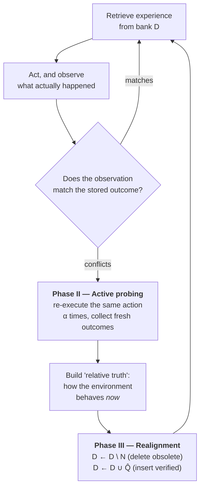

# GLOVE — descriptive summary

**Full title:** GLOVE: **Glo**bal **Ve**rifier for LLM Memory-Environment Realignment
**Authors:** Xingkun Yin, Hongyang Du (HKU)
**arXiv:** [2601.19249](https://arxiv.org/abs/2601.19249), 27 Jan 2026, cs.AI
**Venue:** none — **unreviewed preprint**
**Code + drift benchmarks:** https://github.com/NICE-HKU/GLOVE

> ⚠️ Don't confuse with **GloVe** (Global Vectors for Word Representation, Stanford 2014) — a word-embedding method, entirely unrelated, and it dominates search results. Search the arXiv ID.

> **Relevance to our track: the closest work to our versioning argument, and it takes real ground. Read this one properly.**
>
> GLOVE's *motivation* is our motivation, stated for agent task memory: stored experience goes stale under drift, and *"the agent cannot identify which specific steps became invalid."* That is the localisation problem, published in January 2026.
>
> **What preserves our contribution is what it does about it.** GLOVE's Algorithm 1, Phase III:
> ```
> D ← D \ N        # remove obsolete counterparts  ← SET DIFFERENCE. Deletion.
> D ← D ∪ {Q̂}     # insert verified summary
> ```
> **It deletes.** "Deprecating obsolete records" means removing them. After GLOVE runs you cannot ask what the memory used to say, when it changed, or whether it has changed back. Our proposal keeps the record and stamps a validity interval on it.
>
> Three further separations: it detects drift by **active probing** (re-executing an action α times — expensive, statistical, and it needs a re-executable environment); it addresses **environment** drift (websites change, obstacles move) rather than **agent capability** drift; and it is not routing.

---

## 1. In one line

When an agent's stored experience disagrees with what it's now seeing, go and poke the environment to find out which is right — then delete the memories that turned out to be wrong.

---

## 2. The problem they're attacking

Memory-augmented agents store what worked before and reuse it. That assumes the world stays put. It doesn't:

> *"real deployments exhibit environmental dynamics in which the underlying response pattern changes due to **interface updates**, moving obstacles, or shifting user preferences. Under such drift, the optimal action for the same apparent context can change, and memory systems that lack a re-validation mechanism default to blind trust, **turning stale memory into a reliability bottleneck**."*

They argue the two existing ways of checking memory both fail under drift:

| Approach | Why it fails |
|---|---|
| **Ground-truth validation** (rewards, verifiers, task success) | Supervision is sparse or delayed, and validates only *terminal* outcomes — not the intermediate steps that actually populate memory |
| **Internal reflection** (the model checks its own memory) | Under drift, internal reasoning decouples from reality. Old experience stays *internally consistent* while being wrong. *"Reflection evaluates coherence with prior beliefs rather than consistency with current environment behavior."* |

Their example: a route that was safe becomes blocked. With no collision signal, a reflecting agent keeps justifying its plan from an obsolete map, and an evaluator only notices failure at the very end of a long trajectory.

**The sentence that matters most to us:**

> *"the agent cannot identify **which specific steps became invalid**, leading it to retrieve and reuse intermediate actions indiscriminately"*

That is the localisation argument — the same one that rescued our project when decision-memory looked like it also went stale.

---

## 3. Their idea: "relative truth"

Don't validate memory against internal belief, and don't wait for external ground truth. **Validate it against the environment, by poking the environment.**



The three phases: **detect dissonance** (probabilistically), **probe** to establish current truth, **realign** memory.

"Global" verifier because it validates against the environment as a whole rather than against a single task's success signal.

---

## 4. The critical detail — it deletes

Phase III is a set difference:

```
D ← D \ N
```

Obsolete records are **removed** from the experience bank and replaced with a freshly verified summary.

So GLOVE is a third variant of the same pattern we found everywhere else — memory is *maintained by destroying the old version*:

| System | Maintenance operation | Old record survives? |
|---|---|---|
| FlyRoute | distil into a description | no — compressed away |
| Agent-as-a-Router | append to kNN store | n/a — nothing is ever retired |
| GraphPlanner | blend into GNN embeddings | no — averaged, no temporal edges |
| **GLOVE** | **`D ← D \ N`** | **no — explicitly deleted** |

**Consequences of deletion**, all of which matter in a bank:
- You cannot ask *when* the change happened.
- You cannot detect that a boundary moved **back**, or that it oscillates.
- **There is no audit trail.** You cannot reconstruct why a decision was reasonable at the time it was made.

---

## 5. How it detects drift — and what that costs

**Active probing:** on a conflict, re-execute the same action under the same state **α times** to estimate the current response pattern.

That requires an environment you can cheaply re-execute against, and it is **statistical** — you need α trials per suspected stale entry, and you only probe entries you happened to notice a conflict on.

Contrast with a deploy-event trigger: an agent version bump identifies *every* affected record instantly, for zero probes, before a single query arrives. **That gap is measurable, and it is our experiment.**

---

## 6. Evaluation

Three domains, each modified to add drift:

| Domain | Setting |
|---|---|
| Web navigation | interface changes |
| Discrete planning | grid-map environment |
| Continuous control | MountainCar (Gymnasium) — *"small environment changes can invalidate prior experience"* |

> *"We introduce a set of controlled environmental drifts applied to standard benchmarks as difficulty-enhanced evaluation settings... applied uniformly across all methods without algorithm-specific tuning."*

**This is the methodology we should copy.** Take standard benchmarks, apply controlled drift interventions uniformly, evaluate everyone under them. They released the drift benchmarks — worth reading the repo for how the interventions are specified.

Headline result: on one benchmark, adding GLOVE to a vanilla agent moves success from **47.5% → 97.5%**. It's positioned as a plug-in that improves diverse memory architectures.

---

## 7. Things to look at closely when you read it

- **Find Algorithm 1, Phase III.** Read `D ← D \ N` carefully, then ask what question you can no longer answer afterwards.
- **What triggers verification?** Probing happens only on *detected conflict*. Ask what happens to a stale record that never gets retrieved, or never visibly conflicts.
- **What does probing cost?** α re-executions per suspected entry. Ask what α would be for a bank guarantee agent, and whether re-executing is even safe.
- **Environment drift vs agent drift.** Theirs is the world changing under a fixed agent. Ours is the agent changing under a fixed world. Ask whether the mechanisms should differ — and whether a deploy event has any analogue in their setting.
- **Their drift methodology.** Controlled interventions applied uniformly across methods. Ask what the routing equivalent looks like.

---

## My notes

<!-- your notes below -->
