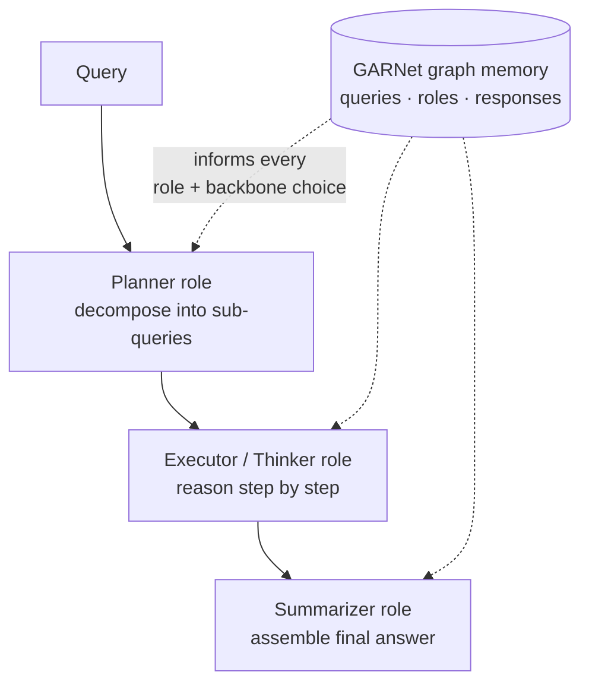

# GraphPlanner — descriptive summary

**Full title:** GraphPlanner: Graph Memory-Augmented Agentic Routing for Multi-Agent LLMs
**Authors:** Tao Feng, Haozhen Zhang, Zijie Lei, Peixuan Han, Jiaxuan You (UIUC)
**arXiv:** [2604.23626](https://arxiv.org/abs/2604.23626), 26 Apr 2026, cs.CL
**Venue:** none — **unreviewed preprint**, formatted in the ICLR template (its only ICLR mention is the template's Code of Ethics boilerplate; this is *not* an acceptance)
**Code:** https://github.com/ulab-uiuc/GraphPlanner

> **Relevance to our track: not a competitor — but it strengthens the versioning claim.**
>
> Their "agents" are **fixed workflow roles** (Planner, Executor/Thinker, Summarizer), not competing domain specialists. The task is *build a pipeline and staff each stage with a model*, not *which of ten overlapping experts owns this query*. Different problem.
>
> Why it matters anyway: **it is the third architecture in a row with no temporal structure in its memory.** Its own words — history connects *"through shared neighbors rather than explicit temporal edges."* So there are no dates, no ordering, and no way to invalidate a time range. History is blended into node embeddings by message passing.
>
> Also note their generalisation result is about **unseen** LLMs (cold start — a new agent joins), never **changed** LLMs (drift — an existing agent moves). That distinction is now worth making explicitly in our write-up, because papers routinely conflate them.

---

## 1. In one line

Given a query, build a small workflow — decompose it, decide which role handles each piece, and pick which model plays that role — using a graph of past interactions to inform every choice.

---

## 2. The problem they're attacking

Ordinary LLM routing picks **one model** for **one call**. They argue that's too thin for real agentic work, which needs *"task planning, multi-round cooperation among heterogeneous agents, and memory utilization."*

So they generalise routing into **two simultaneous decisions at every step**:

1. Which **agent role** to activate — Planner, Executor, Summarizer
2. Which **LLM backbone** should play that role

That's the shift: from *picking a model* to *composing a workflow and staffing it*.

---

## 3. How it works

Workflow generation is framed as a **Markov Decision Process**. At each step the policy picks a (role, backbone) pair; the state is the workflow built so far plus retrieved history. The whole thing is trained with **reinforcement learning**, optimising jointly for task performance and compute cost.

---

## 4. GARNet — the graph memory

Two graphs sharing a set of **role hub nodes** as anchors:

| Graph | What it holds |
|---|---|
| `G_workflow` | The current query. Queries connect to roles via edges *"enriched with task performance and cost information."* Responses link to the roles that produced them; query–response edges preserve semantic alignment. |
| `G_history` | Past queries and past responses, attached to the same role hubs. These *"encode accumulated experience about how roles performed in past interactions."* |

A graph neural network passes messages over both, producing embeddings that condition the next routing decision.

### The structural detail that matters most

> *"Multi-round routing does not introduce additional role nodes. Each newly generated sub-query or response in later rounds is simply appended to the workflow graph and connected to the same shared role hub nodes. This implicitly connects different rounds **through shared neighbors rather than explicit temporal edges**."*

**There is no time dimension in this memory.** Everything hangs off the same role hubs and gets averaged together by message passing. You cannot ask when an interaction happened, order two of them, or invalidate everything before a date.

---

## 5. Results

| Claim | Number |
|---|---|
| Accuracy over strong single- and multi-round routers | up to **+9.3%** |
| GPU cost | **186.26 GiB → 1.04 GiB** |
| Unseen tasks (zero-shot average) | **78%** — 20–40% above previous routers |
| Per unseen dataset | 60% LogicGrid, 92% MGSM, 82% CommonGen |
| Evaluated on | 14 diverse LLM tasks |

**Inductive vs transductive** is their other axis: inductive mode is cheaper, transductive mode performs better at higher cost. Both are supported.

**Unseen LLMs:** it handles backbones never seen in training, with no fine-tuning. Note carefully what this is — a **new** model joining the pool, evaluated cold. It is *not* an existing model whose behaviour changed.

---

## 6. What the authors say is missing

There is no limitations section. The conclusion offers one line of future work:

> *"we plan to incorporate richer agent profiles beyond Planner, Executor, and Summarizer to further enhance agentic routing."*

Worth noticing the direction of travel: they want **richer profiles**. Not richer decision records.

---

## 7. Things to look at closely when you read it

- **What are the "agents" here?** Find the list of roles. Then ask whether "Planner vs Executor" is the same kind of choice as "Amendment agent vs Issuance agent."
- **Where does time live in GARNet?** Find the sentence about temporal edges. Then ask how you would express "this experience is out of date" in this structure.
- **What does message passing do to old experience?** Ask whether a two-year-old interaction and yesterday's are distinguishable after aggregation.
- **"Unseen" vs "changed."** They generalise to unseen LLMs. Ask whether a model that has been *updated* is unseen, changed, or both — and which of the two their evaluation actually tests.
- **Compare the three memory designs:** FlyRoute distils into a description, ACRouter appends to a kNN store, GraphPlanner blends into GNN embeddings. Ask what all three have in common that our proposal doesn't.

---

## My notes

<!-- your notes below -->
